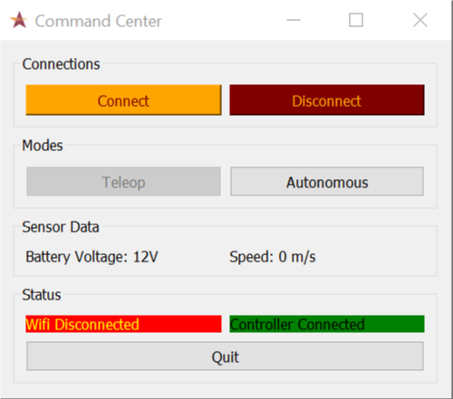
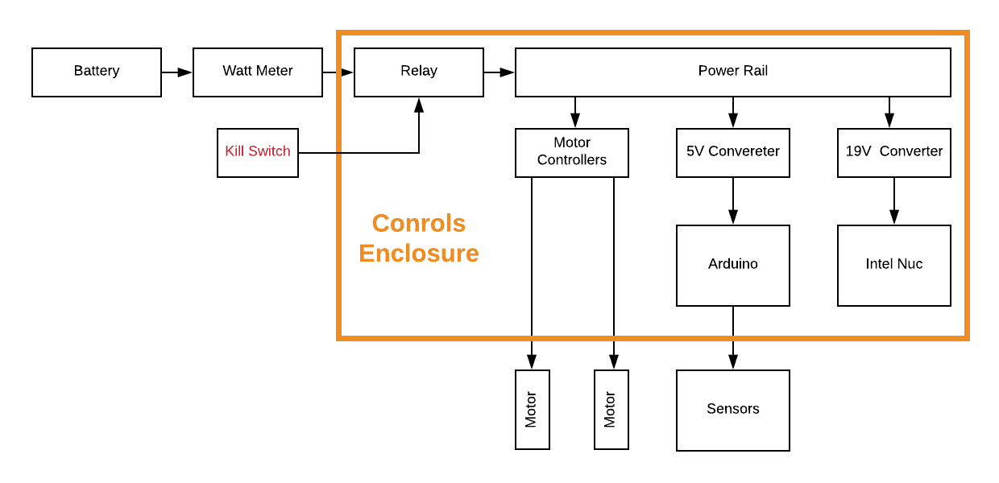
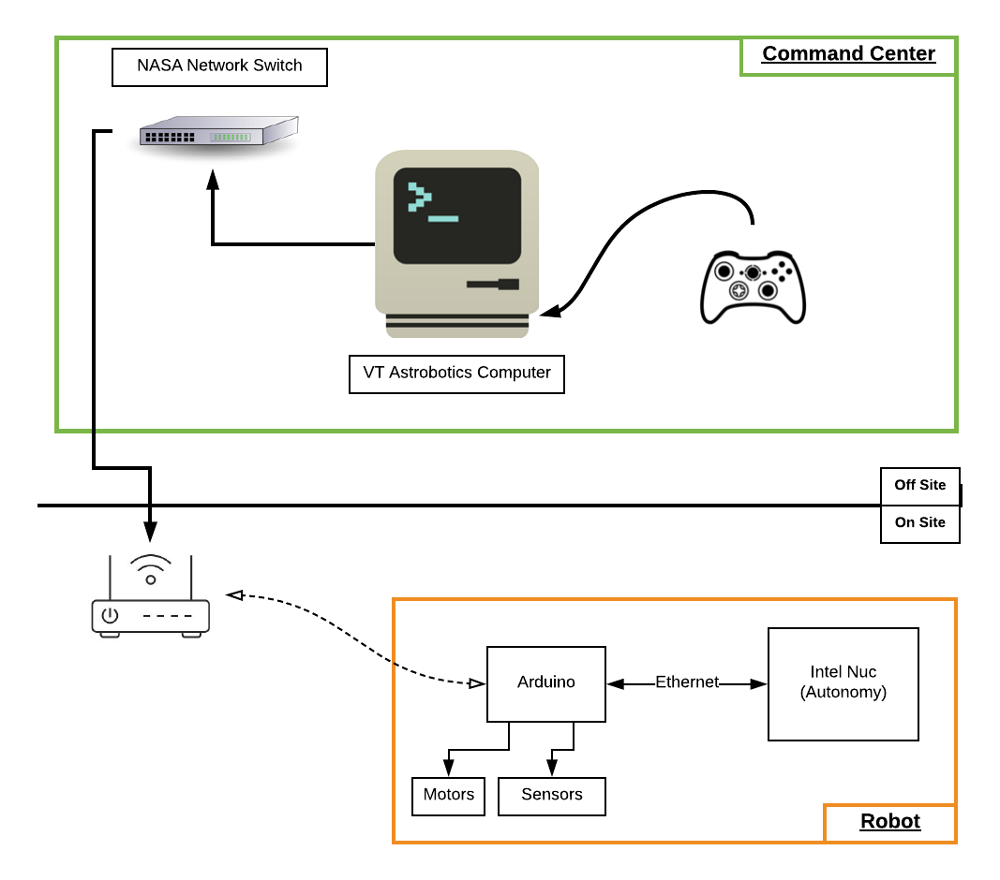

# VT Astrobotics Command Center

This is the command center to be used in NASA RMC.
What's used
  - PyQt for the GUI
  - Xbox wired controller for controlling robot
  - Wifi to send UDP or TCP packets

To be implemented
  - Ethernet to talk to Intel Nuc
  - Custom commands for control: JSON

### Command Center



### Power Block Diagram


### Communication Block Diagram

```cpp

```

### Links
  - [ESP8266 Guide](https://learn.adafruit.com/adafruit-feather-huzzah-esp8266/using-arduino-ide)
  - [ESP8266 Wifi UDP Guide](https://arduino-esp8266.readthedocs.io/en/latest/esp8266wifi/udp-examples.html
)
  - [Python Connectivity Script](http://johnallen.us/?p=236)
  - [JSON UDP](https://arduinojson.org/v5/example/udp-beacon/)
  - [PWM Forum Post](https://arduino.stackexchange.com/questions/421/generating-pwm-signal-1-2-ms-333-hz
)
  - [VESC PPM Arduino](https://www.electric-skateboard.builders/t/rc-servo-ppm-controller-with-arduino/28581)
  - [ESC Arduino](https://forum.arduino.cc/index.php?topic=270309.0)
  -

### Repositories to Use
  - [Xbox Controller](https://github.com/FRC4564/Xbox)
  - [ESP8266 RC Car](https://github.com/indrekots/esp8266-rc-car-controller)
  - [VESC Arduino](https://github.com/shusain/eskatecontroller/)
