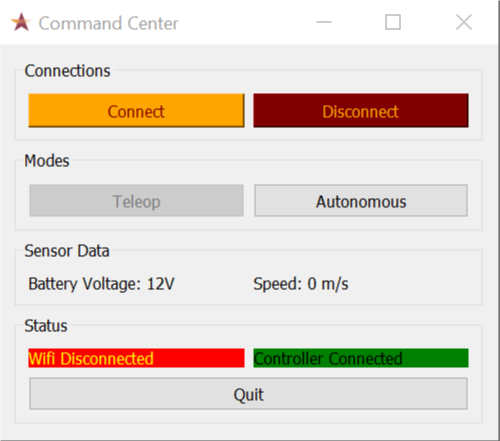

# VT Astrobotics Teleop

### Overview of Software:
The team has selected an Arduino to run the logic for the controls system which includes actuators and sensors of various types. For the command center, a laptop will be running a Python script with wireless network communication to the robot and a graphical user interface (GUI) for control and sensor information

### Robot
The Arduino selected has a WiFi module on board with a compatible software library. Through this library, the Arduino is able to receive and send our custom UDP packets to the command center over WiFi. The UDP packets will consist of commands to move the robot as well as sensor data to monitor robot health. The bandwidth used must be minimal as the competition rules state that points are deducted when more data is sent through the network.
For controlling motors on board, the Arduino needs to send PPM signals to the motor controllers. A built in software library to control servos is capable of sending the proper PPM signal to our motor controllers. Digital signals will be sent to relays for controlling the linear actuators. As a safety precaution, there will be a relay that manages the power to actuators and is controlled by another digital signal.
Lastly, the Arduino will utilize the analog to digital converter on board to read potentiometer values from the linear actuators and mining mechanism arm. This will ensure that limits of the actuators are not exceeded. Analog signals will be sent out to control status RGB LEDs for debugging and feedback.
### Command Center
The team will use a laptop to communicate wirelessly with the robot. Python is our language of choice because of its support for networking, multithreading, and Xbox controller input. The PyQt library provides extensive options for a GUI that will display controls and feedback for the robot.
Wireless communication with the robot will be done using a websocket library for Python. This allows us to customize commands sent in UDP packets. The packets sent to the robot will consist of JSON generated from an Xbox controller input. A Python library has been developed to assist with reading values from the Xbox controller.
Finally, a state machine has been implemented to maintain consistency with the robot’s state. In order to ensure the state machine doesn’t fail, multithreaded programming is applied using a Python library. Multithreading allows the state machine to run concurrently with the GUI as well as the Xbox controller input. Concurrency utilizes more power of the laptop while protecting the state machine from being halted or impeded by failure of the other processes running.

### Robustness
The team’s software design has a number of robust qualities that allow the robot to operate consistently and safely. Multithreaded programming is used in the command center implementation to reduce the chance of full system failure. If the controller input or the GUI cause an unexpected error, the state machine is still able to run in its own thread.
In case of emergency or unknown error, a relay will be able to control the power to actuators. The Arduino may command the shutdown if it finds an error, and the remote operator at the command center will have a button that causes shutdown. A disconnection of the command center from the robot will be considered a failure and the robot will cease operation until reconnection. The LEDs on the robot will help show the operator the state of the robot during operation. In addition, while operating, a certain button will need to be held down to initiate commands to the robot. This extra step ensures that the operator is fully aware and intending to send the command.

```cpp

```

#### To be implemented
  - JSON
  - Static IP
  - Xbox controller input
  - Failure Mode

### Links
  - [ESP8266 Guide](https://learn.adafruit.com/adafruit-feather-huzzah-esp8266/using-arduino-ide)
  - [ESP8266 Wifi UDP Guide](https://arduino-esp8266.readthedocs.io/en/latest/esp8266wifi/udp-examples.html
)
  - [Python Connectivity Script](http://johnallen.us/?p=236)
  - [JSON UDP](https://arduinojson.org/v5/example/udp-beacon/)
  - [JSON UDP](https://randomnerdtutorials.com/decoding-and-encoding-json-with-arduino-or-esp8266/)
  - [PWM Forum Post](https://arduino.stackexchange.com/questions/421/generating-pwm-signal-1-2-ms-333-hz
)
  - [VESC PPM Arduino](https://www.electric-skateboard.builders/t/rc-servo-ppm-controller-with-arduino/28581)
  - [ESC Arduino](https://forum.arduino.cc/index.php?topic=270309.0)
  - [WebSocket JSON Python Arduino](https://techtutorialsx.com/2017/11/05/esp32-arduino-websocket-server-receiving-and-parsing-json-content/)

### Repositories to Use
  - [Xbox Controller](https://github.com/FRC4564/Xbox)
  - [ESP8266 RC Car](https://github.com/indrekots/esp8266-rc-car-controller)
  - [VESC Arduino](https://github.com/shusain/eskatecontroller/)
  - [Arduino JSON](https://github.com/bblanchon/ArduinoJson/)
